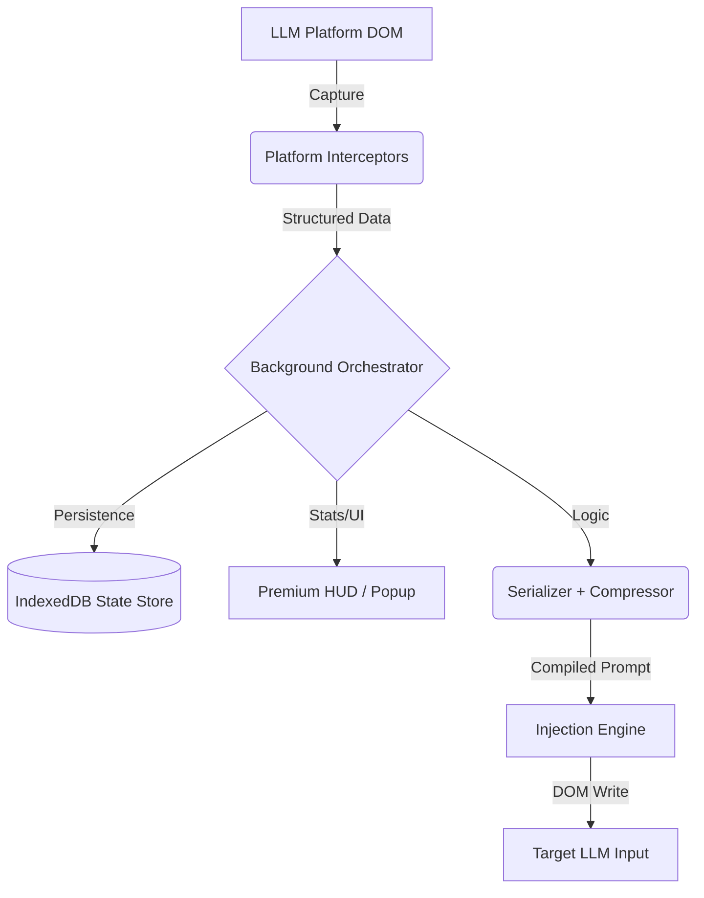

#  CLO — Cross-LLM Context Orchestrator

> **Deterministic Reasoning Portability for the Era of Heterogeneous Intelligence.**

CLO (Cross-LLM Orchestrator) is a specialized browser extension designed to eliminate context loss when switching between different LLM platforms. It acts as a **"Reasoning State Virtual Machine"**, capturing the cognitive state of a conversation and enabling it to be "rehydrated" into any other model seamlessly.

[](#)
[](#)
[](https://opensource.org/licenses/MIT)

---

## ✨ Features

- 🔄 **Reasoning Portability**: Transfer complex tasks between ChatGPT, Claude, Gemini, and Grok without repeating yourself.
- 🧠 **Context Extraction**: Automatically parses constraints, decisions, and artifacts from your conversation using a canonical JSON schema.
- ⚡ **Zero-Friction Rehydration**: Single-click "Inject" automatically compiles and adapts your state into the next model's input field.
- 📉 **Semantic Compression**: Intelligently compresses conversation history to save tokens while preserving critical reasoning paths.
- 🔗 **Provenance Tracking**: A "git log" for your thoughts — know exactly which model made which decision.
- 💎 **Premium HUD**: Minimalist, glassmorphism-inspired UI that stays out of your way until you need it.

---

## 🛠 Quick Start

### 1. Installation
Currently in Developer Preview. To install manually:

1.  **Clone the Repo**:
    ```bash
    git clone https://github.com/your-repo/clo-extension.git
    cd clo-extension
    ```
2.  **Install Dependencies**:
    ```bash
    npm install
    ```
3.  **Build the Project**:
    ```bash
    npm run build
    ```

### 2. Loading into Chrome/Brave/Edge
1.  Open your browser and navigate to `chrome://extensions/`.
2.  Enable **Developer mode** (toggle in the top-right corner).
3.  Click **Load unpacked**.
4.  Select the **`dist`** folder (created inside your project directory after running the build).

---

## 📖 Usage Guide

1.  **Capture**: Open any supported LLM (ChatGPT, Claude, or Gemini). Start your conversation as usual.
2.  **Monitor**: Notice the **CLO HUD** in the bottom-right corner. It tracks turns, detected models, and reasoning primitives in real-time.
3.  **Export/Switch**: When you reach a point where you want to switch models (e.g., from GPT-4o to Claude 3.5 Sonnet):
    - Simply open the new platform.
    - Click **⚡ Inject** in the HUD.
    - CLO will automatically compile the reasoning state and paste it into the prompt box.
4.  **Continue**: Hit Enter, and the new model will pick up exactly where the last one left off, aware of all previous constraints and decisions.

---

## 🏗 Architecture



### Core Primitives
| Component | Responsibility |
| :--- | :--- |
| **Interceptors** | Platform-specific DOM observers (MutationObserver) |
| **Serializer** | Mapping raw text to the `ReasoningState` schema |
| **Compressor** | Semantic folding of long histories using model-aware logic |
| **Injector** | Adapting state into model-specific prompt frames |

---

## 📋 Platform Support Matrix

| Platform | Status | Model Detection | Capture | Injection |
| :--- | :--- | :---: | :---: | :---: |
| **ChatGPT** | ✅ Active | ✅ | ✅ | ✅ |
| **Claude** | ✅ Active | ✅ | ✅ | ✅ |
| **Gemini** | ✅ Active | ✅ | ✅ | ✅ |
| **Grok** | 🟡 Beta | Minimal | 🚧 | ✅ |

---

## 🔬 Contributing

We're building the future of deterministic reasoning. Contributions are welcome!

1.  Fork the repository.
2.  Create your feature branch (`git checkout -b feature/amazing-feature`).
3.  Commit your changes (`git commit -m 'Add amazing feature'`).
4.  Push to the branch (`push origin feature/amazing-feature`).
5.  Open a Pull Request.

---

## 📄 License

Distributed under the **MIT License**. See `LICENSE` for more information.

---

<p align="center">
  Built with ❤️ for the LLM community.
</p>


By - Anurag
